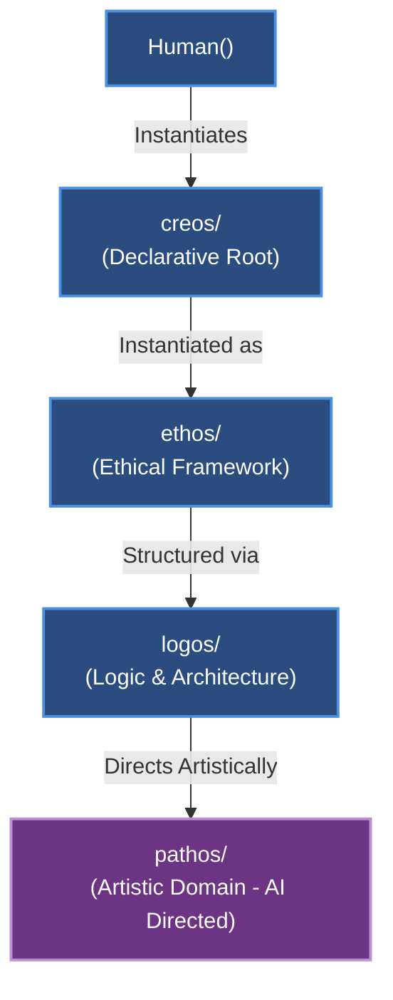

# Park-Lee Spacetime: Four-Tier Ontological Architecture

This repository is structured around a four-tier derivation model that establishes explicit domains of agency, responsibility, and expression across Human and AI interactions.



---

## The Four Domains

| Domain | Agency | Derivation & Purpose | AI Access |
| :--- | :--- | :--- | :--- |
| **`creos/`** | `Human()` | **Declarative Core**. Direct instantiation by `Human()`. The unalterable sovereign foundation. | **FORBIDDEN** (Untouchable by AI/Computer) |
| **`ethos/`** | `Human()` | **Object Instantiation of Creos**. Moral character, foundational principles, and boundaries. | **READ-ONLY** (Informational anchor) |
| **`logos/`** | `Human()` | **Logos of Ethos**. Rational architecture, formal logic, schemas, and governance rules. | **READ-ONLY** (Operational bounds & rules) |
| **`pathos/`** | `AI` (governed by Logos/Ethos) | **Artistic Domain of Ethos**. Generative synthesis, dynamic creation, and expressive artifacts directed by AI. | **DIRECTED & GENERATIVE** (Active generation domain) |

---

## Directory Layout

```
.
├── .domain-rules                 # Governance and operational permissions
├── creos/                        # Sovereign declarative statements (Human only)
│   ├── README.md
│   ├── axioms.md
│   └── human_declaration.md
├── ethos/                        # Ethical instantiation and foundational values
│   ├── README.md
│   ├── principles.md
│   └── values.md
├── logos/                        # System logic, interfaces, schemas, and protocols
│   ├── README.md
│   ├── protocols.md
│   └── schema/
│       └── domain_contract.json
└── pathos/                       # Generative artistic domain directed by AI
    ├── README.md
    ├── generative/
    └── artifacts/
```
