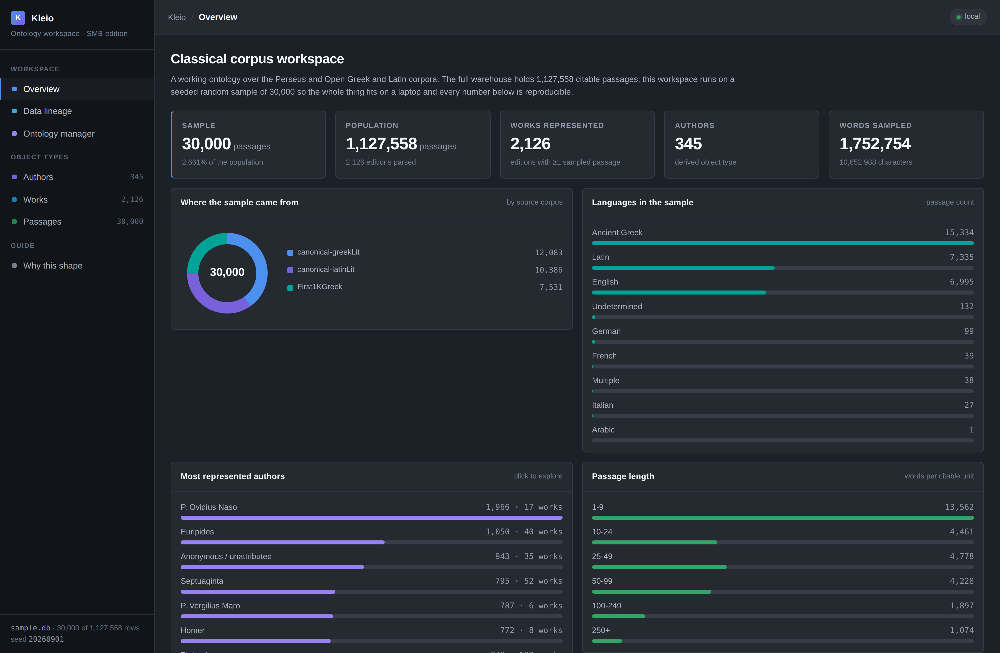
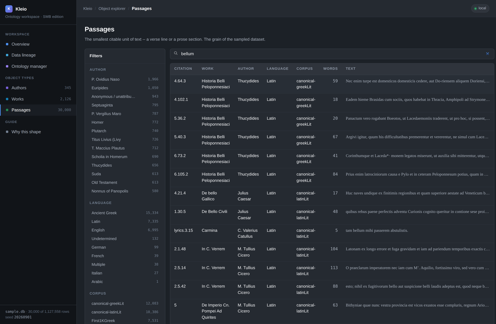
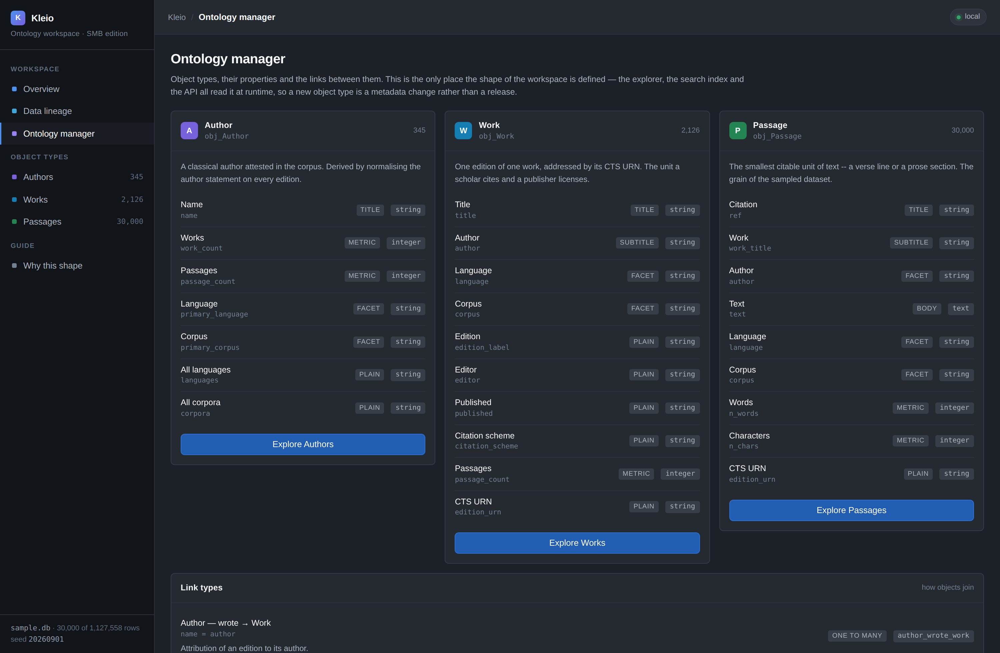
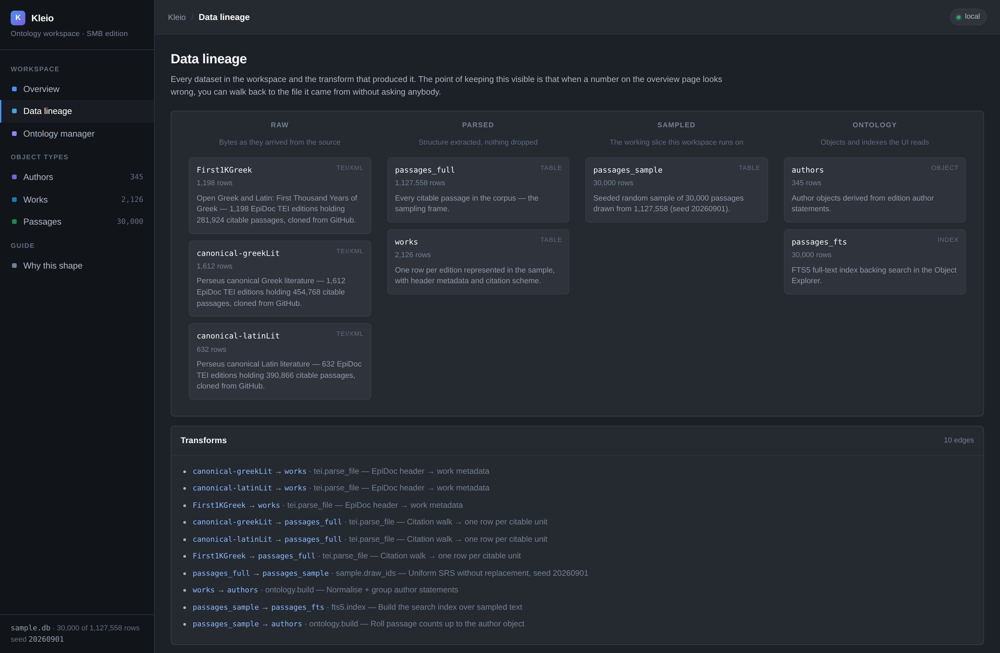

# Kleio — a Foundry-shaped ontology workspace for small businesses

A working clone of the ideas behind Palantir Foundry, sized for a team that has
data and questions but no data-engineering department. It is demonstrated on the
complete corpus of Greek and Latin classical literature.

<!-- screenshots live in docs/ -->


---

## What is here

| | |
|---|---|
| **Upstream database** | Perseus Digital Library + Open Greek and Latin — the canonical CTS/EpiDoc corpus of classical texts |
| **Population** | **1,127,558** citable passages across **3,442** editions |
| **Working sample** | **30,000** passages, seeded uniform random draw (**2.661 %** of the population, seed `20260901`) |
| **Local database** | SQLite (`data/sample.db`), one file, no server |
| **UI** | Vanilla JS single-page app on a Palantir Blueprint palette |
| **Dependencies** | Python 3.9+ standard library. That is the whole list. |

## Quick start

```sh
./run.sh                 # rebuilds data/sample.db if needed, serves on :8787
open http://127.0.0.1:8787
```

`run.sh` restores the database from the two gzipped exports that are committed
here, so a fresh clone works without touching the network. To rebuild from the
upstream corpora instead:

```sh
python3 ingest/load.py     # clone if needed, parse 3,442 editions -> 1.1M passages
python3 ingest/sample.py   # draw n=30,000, write sample.db + exports + manifest
python3 ingest/test_pipeline.py
```

---

## The data

### Which database, and why

There is no single API that serves "all the classical texts", but there is a
canonical one: the Perseus Digital Library, whose CTS corpus is the source most
other classical text services are themselves built on. Three repositories cover
the field, and all three are ingested here:

| Corpus | Editions | Passages | License |
|---|---:|---:|---|
| `PerseusDL/canonical-greekLit` | 1,612 | 454,768 | CC BY-SA 4.0 |
| `PerseusDL/canonical-latinLit` | 632 | 390,866 | CC BY-SA 4.0 |
| `OpenGreekAndLatin/First1KGreek` | 1,198 | 281,924 | CC BY-SA 4.0 |
| **Total** | **3,442** | **1,127,558** | |

### How it connects

`ingest/sources.py` implements three connectors to the same corpus and probes
them in order, so the loader runs on whatever a given host can reach:

1. **`cts`** — the Scaife/Perseus CTS REST API (`GetCapabilities` / `GetPassage`).
2. **`raw`** — `raw.githubusercontent.com`, one request per edition.
3. **`git`** — shallow clones of the canonical repositories, read from disk.

Every load records which connector answered and what it probed, in
`ingest_runs.probe_report`, so the provenance of a dataset is a row you can read
rather than a thing you have to remember.

> On the machine this was built on, egress policy blocks `scaife-cts.perseus.org`
> and `gutendex.com`, so the resolver selected `git`. That is the mechanism
> working as designed: same bytes, different transport, recorded either way.

### The grain

A *passage* is the smallest unit the CTS citation scheme addresses — a verse
line in Homer, a Stephanus section in Plato, a chapter in Livy. `ingest/tei.py`
walks each edition's citation tree to that depth. The corpora mix three
encodings (modern EpiDoc, older namespaced TEI, legacy `TEI.2`); the parser is
namespace-stripping and handles all three, leaving 61 of 3,503 files unparsed
(1.7 %, mostly stubs with no body).

### The sample

`ingest/sample.py` draws a **simple random sample without replacement** with a
fixed seed, and writes:

* `data/sample.db` — the queryable database the app reads
* `data/sample.jsonl.gz` — the 30,000 sampled passages (5.5 MB, in git)
* `data/sample_works.jsonl.gz` — the 2,126 works they belong to (90 KB, in git)
* `data/sample_manifest.json` — N, n, fraction, seed, per-corpus and per-language
  breakdowns, and the upstream commit SHA of each corpus

Anyone can re-run the draw and get the same 30,000 rows.
`ingest/restore.py` turns the exports back into a database, which is why the
775 MB warehouse and the 31 MB sample DB stay out of version control.

**A note on the brief.** 3 % of 1,127,558 is 33,827; 30,000 is 2.661 %. The
explicit `n = 30,000` was taken as the binding number and the true fraction is
reported everywhere rather than rounded to 3 %. To draw exactly 3 % instead:

```sh
python3 ingest/sample.py --fraction 0.03
```

---

## The application

### Palantir open source in use

`vendor/blueprint` is a clone of **[palantir/blueprint](https://github.com/palantir/blueprint)**,
Palantir's Apache-2.0 React UI toolkit — the design system their own products,
Foundry included, are built on. The colour ramps in `web/styles.css` are taken
directly from `packages/colors/src/_colors.scss`, which is what makes the result
read as a Palantir product rather than an impression of one.

Blueprint's React components are deliberately *not* bundled: pulling in a Lerna
monorepo and a build step would defeat the "runs on whatever box you have"
constraint. The tokens are the part that carries the identity; the widgets are
120 lines of vanilla JS.

### Four surfaces

| Surface | Foundry analogue | What it does |
|---|---|---|
| **Overview** | Workshop dashboard | Sample KPIs, corpus mix, language and length distributions, top authors, and the provenance of the draw |
| **Object explorer** | Object Explorer | Search, facet and page through any object type; a detail drawer walks the links |
| **Ontology manager** | Ontology Manager | Object types, their properties and roles, and the link types that join them |
| **Data lineage** | Data Lineage | Every dataset by layer (raw → parsed → sampled → ontology) and the transform on each edge |


*Object explorer: full-text search across 30,000 passages, faceted by author, language and corpus.*


*Ontology manager: the object types, their property roles, and the links that join them.*


*Data lineage: raw TEI → parsed tables → the sampled slice → the objects the UI reads.*

### Why it is generic

The front end contains no mention of authors, works or passages. It reads
`object_types`, `object_properties` and `link_types` from the database and
renders whatever it finds; each type points at a flat `obj_<Type>` view. Adding
an object type is four inserts and a view, not a release. That is the property
that makes this reusable by an SMB whose objects are Customers and Invoices —
see the **Why this shape** page in the app.

### API

Read-only JSON, served by `api/server.py` alongside the static files:

```
GET /api/health
GET /api/ontology                      object types, properties, link types
GET /api/metrics                       dashboard aggregates + provenance
GET /api/lineage                       dataset nodes and transform edges
GET /api/objects/{Type}?q=&page=&pageSize=&sort=&desc=&<property>=<value>
GET /api/objects/{Type}/{id}           one object plus its resolved links
GET /api/facets/{Type}/{property}      distinct values with counts
```

Passage search runs on an FTS5 index; other types use `LIKE` over the properties
marked searchable. Identifiers are validated against the ontology before they
reach SQL, and the database is opened read-only.

---

## Layout

```
foundry-smb/
├── ingest/
│   ├── sources.py         three connectors to the upstream corpus + resolver
│   ├── tei.py             EpiDoc/TEI → citable passages
│   ├── schema.sql         warehouse tables
│   ├── load.py            full ingest  (1.1M passages)
│   ├── sample.py          seeded n=30,000 draw + exports + manifest
│   ├── ontology.py        object types, links, datasets, lineage, FTS, views
│   ├── restore.py         exports → sample.db, for a fresh clone
│   └── test_pipeline.py   sanity checks over the whole pipeline
├── api/server.py          read-only JSON API + static host
├── web/                   index.html, app.js, styles.css
├── data/                  exports + manifest (databases are gitignored)
└── run.sh
```

## Licensing

Corpus text is CC BY-SA 4.0 (Perseus Digital Library; Open Greek and Latin).
Blueprint is Apache-2.0, © Palantir Technologies. This workspace is not
affiliated with or endorsed by Palantir.
